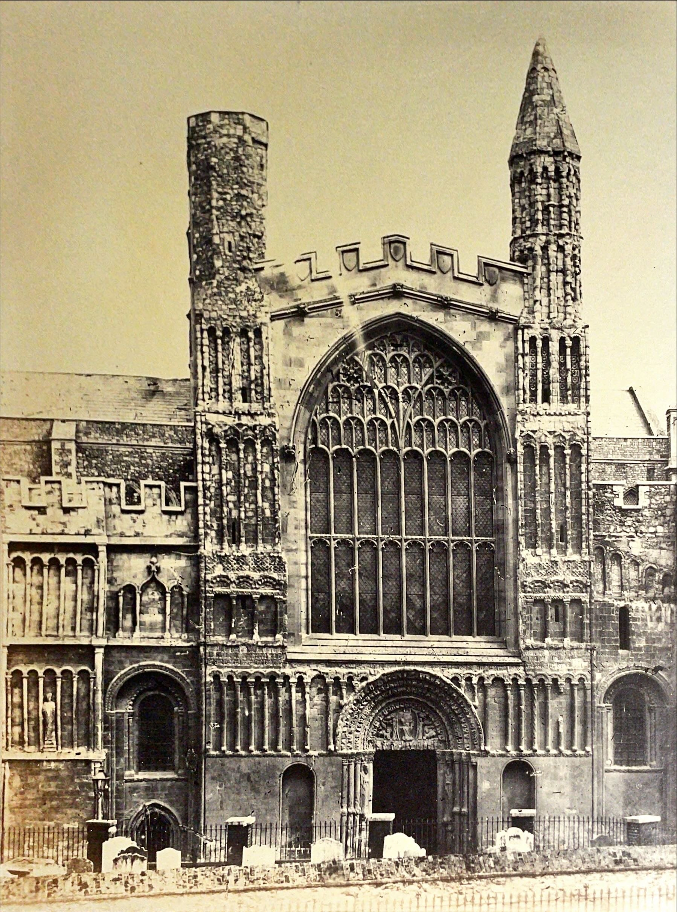

# Rochester Cathedral: early photographs 

Rochester Cathedral organ Pre 1876 

Not the difference in rood (stone case between quire) not showing the 6 great bishops of rochester, and no second tier of the steps

“ Also note the difference in organ this is before Gilbert Scots renovation in 1878 

3 obvious differences in chairs (you had to expect that) although there aren’t many differences to the pillars and roof. We can't see from this angle whether the green men are on the ceiling.

4. Notice the gate in the organ case. Currently it is a blue curtain, Benefit or downside? 
Rochester Cathedral organ 1888. Showing the building and reconstructed organ (Gilbert Scot ) 

1 Same chairs, presumably, but she has done her good multiplication trick again, (having 10 in one visit and 200 in another)

2 Nate nave choir stalls, today the current stalls are movable, (potentially these are too) although it is unclear, Note also the addition of the current pulpit [centre left] and again absence of altar. There is however a small stand where such things presumably happen.

3. Still absence of bishops. Missing off of the organ case still. Seems they have a lot to do in 134 years, they will get there..

Absence of electric lights, it is 1888 but they aren’t there 

Rochester cathedral West end, looking east, This picture can be dated between 1820-1904. 

1. Obvious missing spire, it looks like the current Worcester cathedral, Although many of the other parts of the cathedral remain as they are now. 

2. Although prominent now, St Nicholas church can be seen in the corner on the picture, now used as the diocese office. (does make you wonder) 

3. Note the two towers on the front of the building. There are currently four, although the bse of both the wings are correct, it makes me think that they were added afterwards. 

4. There are still the iconic cloisters and garth house, although not shown, we can assume its presence by its current age, My estimation is around 170 years. Give or take
